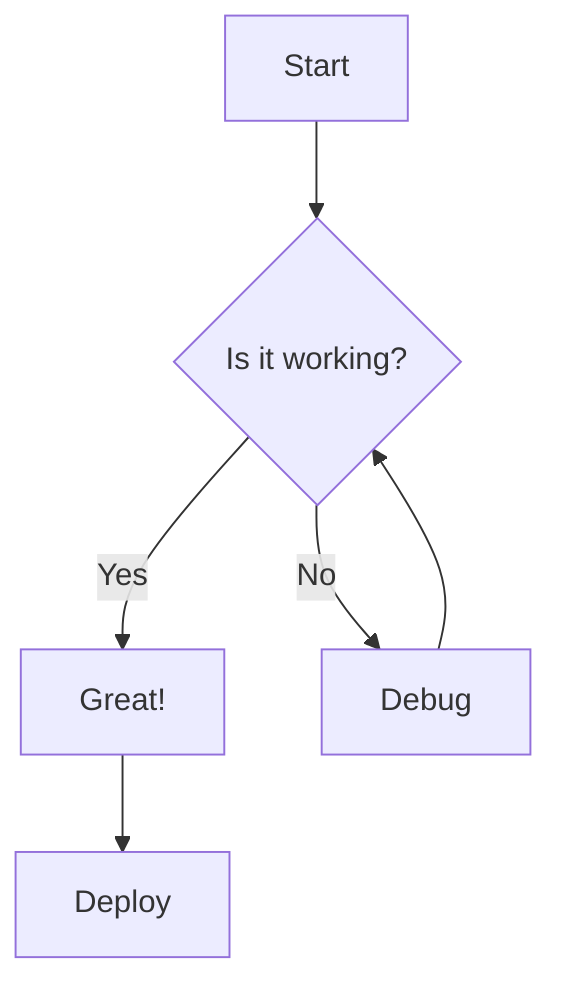

This post demonstrates that LaTeX math formulas, code syntax highlighting, and various Markdown features render correctly on this blog.

## Inline Math

Euler's identity: $e^{i\pi} + 1 = 0$ is beautiful. The Pythagorean theorem states $a^2 + b^2 = c^2$. The Gaussian integral: $\int_{-\infty}^{\infty} e^{-x^2} dx = \sqrt{\pi}$.

## Display Math

The **Bayes' theorem**:

$$P(A|B) = \frac{P(B|A) \cdot P(A)}{P(B)}$$

The **matrix form** of a linear system:

$$
\begin{bmatrix}
a_{11} & a_{12} & \cdots & a_{1n} \\
a_{21} & a_{22} & \cdots & a_{2n} \\
\vdots & \vdots & \ddots & \vdots \\
a_{m1} & a_{m2} & \cdots & a_{mn}
\end{bmatrix}
\begin{bmatrix} x_1 \\ x_2 \\ \vdots \\ x_n \end{bmatrix}
=
\begin{bmatrix} b_1 \\ b_2 \\ \vdots \\ b_m \end{bmatrix}
$$

The **Fourier transform**:

$$\hat{f}(\xi) = \int_{-\infty}^{\infty} f(x)\ e^{-2\pi i x \xi}\ dx$$

**Maxwell's equations** (differential form):

$$
\begin{aligned}
\nabla \cdot \mathbf{E} &= \frac{\rho}{\varepsilon_0} \\
\nabla \cdot \mathbf{B} &= 0 \\
\nabla \times \mathbf{E} &= -\frac{\partial \mathbf{B}}{\partial t} \\
\nabla \times \mathbf{B} &= \mu_0 \left(\mathbf{J} + \varepsilon_0 \frac{\partial \mathbf{E}}{\partial t}\right)
\end{aligned}
$$

## Code Syntax Highlighting

Python:

```python
import numpy as np
from sklearn.linear_model import LinearRegression

def gradient_descent(X, y, alpha=0.01, epochs=1000):
    """Simple gradient descent implementation."""
    m, n = X.shape
    theta = np.zeros(n)
    
    for _ in range(epochs):
        h = X @ theta
        gradient = (1/m) * X.T @ (h - y)
        theta -= alpha * gradient
    
    return theta

# Generate sample data
X = np.random.randn(100, 3)
y = 2 * X[:, 0] - 1.5 * X[:, 1] + 0.5 * X[:, 2] + np.random.randn(100) * 0.1
theta = gradient_descent(X, y)
print(f"Fitted parameters: {theta}")
```

JavaScript:

```javascript
// QuickSort implementation
function quickSort(arr) {
  if (arr.length <= 1) return arr;
  
  const pivot = arr[Math.floor(arr.length / 2)];
  const left = arr.filter(x => x < pivot);
  const middle = arr.filter(x => x === pivot);
  const right = arr.filter(x => x > pivot);
  
  return [...quickSort(left), ...middle, ...quickSort(right)];
}

console.log(quickSort([3, 6, 8, 10, 1, 2, 1]));
```

C++:

```cpp
#include <iostream>
#include <vector>
#include <algorithm>

template <typename T>
T fast_pow(T base, int exp) {
    T result = 1;
    while (exp > 0) {
        if (exp & 1) result *= base;
        base *= base;
        exp >>= 1;
    }
    return result;
}

int main() {
    std::cout << "2^10 = " << fast_pow(2, 10) << std::endl;
    return 0;
}
```

## Admonitions / Callouts

> **💡 Tip**: This is a blockquote. You can use it for tips and notes.

> **⚠️ Warning**: Make sure to check your assumptions before drawing conclusions.

## Tables

| Algorithm | Time Complexity | Space Complexity | Stable |
|-----------|----------------|------------------|--------|
| QuickSort | $O(n \log n)$ avg, $O(n^2)$ worst | $O(\log n)$ | No |
| MergeSort | $O(n \log n)$ | $O(n)$ | Yes |
| HeapSort | $O(n \log n)$ | $O(1)$ | No |
| InsertionSort | $O(n^2)$ | $O(1)$ | Yes |

## Mermaid Diagrams



## Task Lists

- [x] Set up the blog
- [x] Configure MathJax
- [x] Test code highlighting
- [ ] Write more articles
- [ ] Promote the blog

## Definition Lists

Kramdown
: The default Markdown processor for Jekyll, supporting GFM and math.

MathJax
: A JavaScript display engine for LaTeX math, working in all browsers.

---

That's all! Everything should render correctly. If you see beautifully formatted math and syntax-highlighted code, your blog is ready to go.
