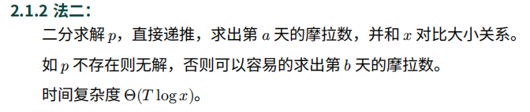

## 图片改进
<!-- more -->

网站logo由


修改为


并且网站主页背景图片也进行了修改。


**重大改进**

之前博客插入图片，采用绝对路径或者相对路径，采用md的插入方法或者html的插入方法，都无法在网站中显示出来，在github和typora都显示正常。

在路径中使用 "\\" 或者 "/" 都可正常显示，区别不大。

正常显示语法可以采用html的图片插入格式，但路径需为绝对路径，且为根地址。

```html

```

但是这能在网站上正常显示，本地却显示不了，因此后续我博客中图片将使用两次插入，以实现本地与网站皆能显示，直到我完善网站功能后。

如下代码所示：

```html


```

为了方便调用，后续我图片也会按照日期时间保存在 `_posts/assets` 目录下。


